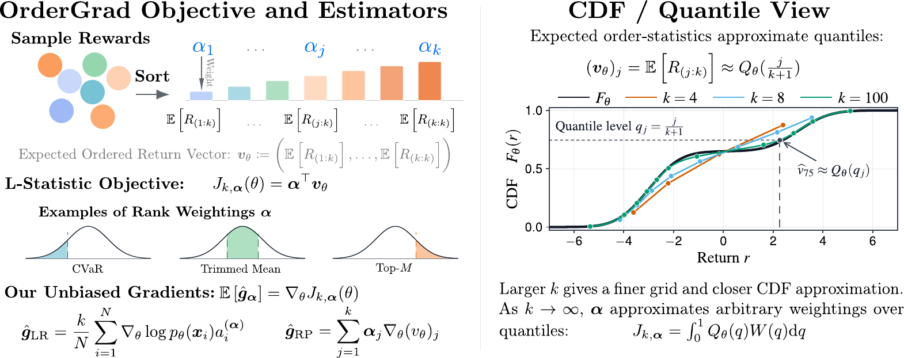

# OrderGrad

`ordergrad` implements fast order-statistic and L-statistic reward transforms for optimizing objectives beyond the ordinary mean. It can be used as a plug-in reward/advantage transformation for likelihood-ratio policy-gradient methods, or as a differentiable rank-weighted value for reparameterized/pathwise gradients.

<p align="center">
  
</p>

**Paper:** [OrderGrad: Optimizing Beyond the Mean with Order-Statistic Policy Gradient Estimation](https://arxiv.org/abs/2606.06096)  
**License:** MIT

OrderGrad sorts rewards inside a comparison set, chooses which ranks matter, and targets the corresponding distributional objective. By changing only the rank weights, the same code covers Max@K / best-of-K, Top-M@K, lower-tail or CVaR-style learning, upper-tail objectives, medians, trimmed means, winsorized means, quantiles, and other L-statistics. The figure (right side) shows how increasing k makes the order-statistics approach the CDF of the
distribution, thus allowing to get more accurate approximations of arbitrary weightings on the reward distribution. See the paper for more details.

Implemented backends:

- NumPy
- PyTorch
- JAX

---

## Installation

From a local checkout:

```bash
pip install -e .
```

Optional backend dependencies:

```bash
pip install -e ".[torch]"
pip install -e ".[jax]"
pip install -e ".[dev]"
```

`import ordergrad` requires only NumPy. PyTorch and JAX are imported lazily when their backends are requested.

---

## Quick start: standard LR / score-function policy gradient

The most common use is a REINFORCE-style, GRPO-style, or PPO-style policy-gradient update. The ordinary mean-reward objective is

$$
J_{\mathrm{mean}}(\theta) = \mathbb{E}_{x \sim p_\theta}\left[R(x)\right],
$$

and the usual likelihood-ratio / score-function estimator is

$$
\widehat{g}_{\mathrm{mean}}
= \frac{1}{N}\sum_{i=1}^{N} (R_i - b_i)\nabla_\theta \log p_\theta(x_i),
$$

where `b_i` is a baseline that does not depend on the sampled action, trajectory, or completion whose score term it multiplies.

OrderGrad keeps the same estimator structure, but replaces `R_i - b_i` with a rank-based advantage:

$$
\widehat{g}^{\alpha}_{\mathrm{LR\text{-}OG}}
= \frac{K}{N}\sum_{i=1}^{N} a_i^{(\alpha)}\nabla_\theta \log p_\theta(x_i).
$$

Here `K` is the order-statistic comparison size, and `alpha` or a preset string such as `"TopM:2"` specifies which sorted ranks to optimize.

```python
import torch
from ordergrad import get_backend

# One comparable group of N policy samples. In LLM training this is often
# one prompt with N rollouts; in RL it can be a group of sampled trajectories.
N = 8
K = 4                         # LR advantages require K < N
objective = "TopM:2"           # average the top 2 rewards from a K-sample group

OG = get_backend("torch").OrderStatTransform
device = torch.device("cuda" if torch.cuda.is_available() else "cpu")
og = OG.precompute_lstat(
    N,
    K,
    objective,
    dtype=torch.float32,
    device=device,
)

# logp: shape (N,), differentiable log probability of each sampled item
# rewards: shape (N,), scalar reward for each item; higher is better
# In language-model RL, logp is commonly the summed token log-probability
# of each generated completion under the current policy.
logp = ...      # torch.Tensor, requires grad through the policy
rewards = ...   # torch.Tensor, usually no grad needed for LR / score-function updates

adv = og.lstat_advantage(rewards)        # shape (N,), detached by default
loss = -(K * adv * logp).mean()          # gradient = -(K/N) sum_i adv_i grad logp_i

optimizer.zero_grad(set_to_none=True)
loss.backward()
optimizer.step()
```

For multiple independent groups, precompute the OrderGrad transform once for the shared group size and reuse it for every group (or better, precompute it and reuse the same one across different optimization iterations). Then compute rank advantages separately within each group and average the losses. Do not mix prompts, tasks, states, or contexts unless the rewards are meant to be ranked against each other.

```python
def ordergrad_pg_loss(logp_groups, reward_groups, *, K=4, objective="TopM:2"):
    """Return a policy-gradient loss for a list of same-sized groups."""
    if len(logp_groups) != len(reward_groups):
        raise ValueError("logp_groups and reward_groups must have the same length")
    if not reward_groups:
        raise ValueError("at least one group is required")

    N = reward_groups[0].numel()
    dtype = reward_groups[0].dtype
    device = reward_groups[0].device
    if any(r.numel() != N for r in reward_groups):
        raise ValueError("all groups must have the same size; otherwise cache one transform per N")

    OG = get_backend("torch").OrderStatTransform
    og = OG.precompute_lstat(
        N,
        K,
        objective,
        dtype=dtype,
        device=device,
    )

    losses = []
    for logp, rewards in zip(logp_groups, reward_groups):
        adv = og.lstat_advantage(rewards)      # computed separately per group
        losses.append(-(K * adv * logp).mean())
    return torch.stack(losses).mean()
```

If groups have different sizes, keep a small cache such as `cache[(N, dtype, device)] = precompute_lstat(...)` and still reuse the matching transform across all groups with the same `N`.

If you are already using PPO or GRPO, place `adv` where your usual advantage would go. PPO clipping, KL penalties, entropy bonuses, reward normalization, and advantage normalization are separate practical choices; OrderGrad changes the scalar learning signal.

---

## What objective is being optimized?

For a group of `K` i.i.d. rewards, sort from low to high:

$$
R_{(1:K)} \le \cdots \le R_{(K:K)}.
$$

An OrderGrad objective is a finite-sample L-statistic:

$$
J_{K,\alpha}(\theta)
= \mathbb{E}\left[\sum_{j=1}^{K} \alpha_j R_{(j:K)}\right]
= \sum_{j=1}^{K}\alpha_j\mathbb{E}\left[R_{(j:K)}\right].
$$

The weights `alpha` decide where gradient pressure is applied across the reward distribution.

| Preset | Meaning |
| --- | --- |
| `ReMax` | maximum / best-of-`K` objective |
| `ReMin` | minimum-of-`K` objective |
| `Rank:r` | one-based top-rank selector; `Rank:1` is the maximum |
| `TopM:m` | average the top `m` rewards in the `K`-sample group |
| `BotM:m` | average the bottom `m` rewards |
| `TopBot:m` / `MidrangeM:m` | average top `m` and bottom `m` ranks |
| `UpperTailMean:q` | average the top `ceil(q*K)` ranks |
| `LowerTailMean:q` | average the bottom `ceil(q*K)` ranks; useful for lower-tail / CVaR-style reward objectives |
| `Median` | median order statistic |
| `TrimM:m` | trimmed mean after dropping bottom and top `m` ranks |
| `WinsorizedM:m` | winsorized mean after clipping bottom/top extremes |
| `Quantile:q` | Hazen-style quantile rank weighting |
| `HarrellDavis:q` | Harrell-Davis quantile estimator |
| `GiniMeanDifference` / `GMD` | signed L-statistic for spread |
| `LMoment:r` | sample L-moment |

For losses, use `rewards = -losses`, or choose a loss-tail objective and flip the optimization sign consistently.

**Rank-order convention.** The math above uses low-to-high order statistics, so `j = 1` is the minimum. The public API uses top-rank order for user-supplied numeric vectors because this is usually what policy-gradient users expect: `a[0]` means the maximum rank, and `a[-1]` means the minimum rank. Preset strings such as `TopM:2`, `ReMax`, and `LowerTailMean:0.2` handle this convention for you and are usually less error-prone than writing numeric vectors by hand.

---

## Batch regime: values, include-one terms, and LR advantages

Most training code only has a realized minibatch of rewards. OrderGrad treats the batch as a finite population and averages over uniformly selected size-`K` subsets.

Let the realized rewards be `R_1, ..., R_N`, and let `S` be a uniformly sampled size-`K` subset of the batch. The batch value for rank `j` is

$$
v_j = \mathbb{E}\left[(R_S)_{(j:K)} \mid R_{1:N}\right].
$$

After sorting the full batch as

$$
R_{(1:N)} \le \cdots \le R_{(N:N)},
$$

this expectation is a fixed weighted sum:

$$
W_{m,j}^{(N,K)}
= \frac{\binom{m-1}{j-1}\binom{N-m}{K-j}}{\binom{N}{K}},
\qquad
v_j = \sum_{m=1}^{N} R_{(m:N)} W_{m,j}^{(N,K)}.
$$

Out-of-range binomial coefficients are treated as zero. The L-statistic value is

$$
v^{\alpha} = \sum_{j=1}^{K}\alpha_j v_j.
$$

This is what `lstat(rewards, alpha)` computes.

For likelihood-ratio gradients, OrderGrad computes a per-sample scalar multiplier. For item `i`, the include-one value is

$$
q_{i,j}
= \mathbb{E}\left[(R_S)_{(j:K)} \mid i \in S, R_{1:N}\right],
$$

and the leave-one-out baseline is

$$
v^{(-i)}_j
= \mathbb{E}\left[(R_S)_{(j:K)} \mid S \subset [N]\setminus\{i\},\ |S|=K,\ R_{1:N}\right].
$$

The rankwise and L-statistic advantages are

$$
a_{i,j} = q_{i,j} - v^{(-i)}_j,
\qquad
a_i^{(\alpha)} = \sum_{j=1}^{K}\alpha_j a_{i,j}.
$$

This is what `lstat_advantage(rewards, alpha)` returns. The leave-one-out baseline excludes sample `i`, so it satisfies the usual score-function baseline condition. For an i.i.d. batch from the current policy or model, the resulting LR estimator is unbiased for the finite-`K` L-statistic objective under the standard score-function regularity assumptions.

For the max@K special case, [On Advantage Estimates for Max@K Policy Gradients](https://arxiv.org/abs/2606.06080) studies advantage estimates and baseline design for Max@K policy gradients. OrderGrad generalizes that setting from the single maximum rank to arbitrary L-statistic rank weights.

Practical notes:

- LR advantages require `K < N`, because a size-`K` leave-one-out subset must still be possible after removing one sample.
- `lstat_advantage(..., detach_advantage=True)` is the default for PyTorch/JAX. This is the standard LR usage: gradients flow through `logp`, not through the rank transform.
- For fixed `N`, `K`, and objective weights, prefer `precompute_lstat(...)` or `with_lstat_weights(...)` so rank-weight contractions are precomputed once.

---

## RP-style / reparameterization computation

Use the reparameterization path when samples are differentiable transformations of parameter-free noise, for example

$$
x_i = T_\theta(\epsilon_i),
\qquad
R_i = R(T_\theta(\epsilon_i)),
$$

and the reward is differentiable with respect to the sample. In this case, do not use `lstat_advantage`; differentiate the rank-weighted batch value directly:

$$
\widehat{g}^{\alpha}_{\mathrm{RP\text{-}OG}}
= \nabla_\theta v^{\alpha}(\theta).
$$

Away from ties, the sorting permutation is locally constant, so the estimator can be written as

$$
\widehat{g}^{\alpha}_{\mathrm{RP\text{-}OG}}
= \sum_{m=1}^{N} (W\alpha)_m\nabla_\theta R_{(m:N)}(\theta).
$$

```python
import torch
from ordergrad import get_backend

N = 64
K = 16
objective = "LowerTailMean:0.2"

OG = get_backend("torch").OrderStatTransform
device = torch.device("cuda" if torch.cuda.is_available() else "cpu")
og = OG.precompute_lstat(
    N,
    K,
    objective,
    dtype=torch.float32,
    device=device,
    compute_leave_one_out=False,   # not needed for RP value gradients
)

theta = torch.tensor(0.0, device=device, requires_grad=True)
optimizer = torch.optim.Adam([theta], lr=3e-3)

optimizer.zero_grad(set_to_none=True)
eps = torch.randn(N, device=device)
x = theta + eps                         # reparameterized samples
rewards = -(x - 2.0).pow(2)             # differentiable reward
value = og.lstat(rewards)               # rank-weighted scalar value
loss = -value                           # maximize value
loss.backward()
optimizer.step()
```

A max@K example of this pathwise regime is [Retry Policy Gradients in Continuous Action Spaces](https://arxiv.org/abs/2606.05888), which introduces pathwise derivative estimators for retry/max@K objectives in continuous action spaces. OrderGrad generalizes the same idea from the maximum rank to arbitrary rank-weighted L-statistics.

Use the LR route when rewards are black-box or non-differentiable, or when only log-probability gradients are available. Use the RP route when the sampling path and reward are differentiable and you want pathwise gradients.

---

## Known `(r, p)` / exact regime

The library also supports an exact finite-distribution regime. This is useful for diagnostics, small discrete examples, and checking the batch estimators.

A max@K reinforcement-learning example of this exact value/probability viewpoint is [Emergence of Exploration in Policy Gradient Reinforcement Learning via Retrying](https://arxiv.org/abs/2606.00151), which studies a ReMax objective based on the expected maximum return over multiple samples. OrderGrad generalizes this maximum-rank objective to arbitrary rank-weighted objectives.

- `r[b]`: fixed reward value of arm `b`
- `p[b]`: sampling probability for arm `b`, nonnegative and summing to one
- draws are i.i.d. with replacement

```python
import numpy as np
from ordergrad import numpy_backend

og = numpy_backend.OrderStatTransform.precompute(32, 5, dtype=np.float64)

r = np.array([-1.0, 0.2, 1.1, 2.4], dtype=np.float64)
p = np.array([0.1, 0.45, 0.3, 0.15], dtype=np.float64)

v = og.orderstats_known_rp(r, p)                         # shape (K,)
q = og.orderstats_inclusion_known_rp(r, p)               # shape (num_arms, K)
adv = og.orderstats_advantage_known_rp(r, p)             # shape (num_arms, K)
l_value = og.lstat_known_rp(r, p, "TopM:2")              # scalar
l_adv = og.lstat_advantage_known_rp(r, p, "TopM:2")      # shape (num_arms,)
```

These quantities are exact for the specified `(r, p)` model, up to floating-point error.

---

## NumPy batch example

```python
import numpy as np
from ordergrad import numpy_backend

N, K = 30, 8
rewards = np.random.randn(N)

og = numpy_backend.OrderStatTransform.precompute(N, K, dtype=np.float64)

values = og.orderstats(rewards)                         # shape (K,)
include_one = og.orderstats_inclusion(rewards)           # shape (N, K)
leave_one_out = og.orderstats_leave_one_out(rewards)     # shape (N, K)
rank_adv = og.orderstats_advantage(rewards)              # shape (N, K)

l_value = og.lstat(rewards, "TopM:2")                    # scalar
l_adv = og.lstat_advantage(rewards, "TopM:2")            # shape (N,)
```

Torch and JAX expose matching `OrderStatTransform` methods.

---

## API reference

Each backend exposes `OrderStatTransform`.

```python
from ordergrad import get_backend
OrderStatTransform = get_backend("torch").OrderStatTransform
```

Precompute for a fixed batch/group size `N` and objective comparison size `K`:

```python
og = OrderStatTransform.precompute(
    N,
    K,
    compute_conditional=True,
    compute_leave_one_out=True,
    compute_dense_matrices=False,
)
```

`K` may be an integer or real value. Internally, the order-statistic dimension is `floor(K)` and is available as `og.k`.

Batch-regime methods:

- `orderstats(x)`: expected order statistics, shape `(floor(K),)`.
- `orderstats_inclusion(x)`: include-one values, shape `(N, floor(K))`.
- `orderstats_leave_one_out(x)`: leave-one-out values, shape `(N, floor(K))`.
- `orderstats_advantage(x)`: include-one minus leave-one-out, shape `(N, floor(K))`.
- `lstat(x, a)`: rank-weighted scalar value.
- `lstat_inclusion(x, a)`: include-one L-statistic values, shape `(N,)`.
- `lstat_leave_one_out(x, a)`: leave-one-out L-statistic values, shape `(N,)`.
- `lstat_advantage(x, a)`: LR-style L-statistic advantages, shape `(N,)`.
- `lstat_weight_by_rank(a)`: sorted-rank weights for the RP value.
- `lstat_weight_by_item(x, a)`: item-order weights for the RP value, away from ties.

Known-`(r, p)` methods:

- `orderstats_known_rp(r, p)`
- `orderstats_inclusion_known_rp(r, p)`
- `orderstats_advantage_known_rp(r, p)`
- `lstat_known_rp(r, p, a)`
- `lstat_inclusion_known_rp(r, p, a)`
- `lstat_advantage_known_rp(r, p, a)`

You can either pass objective weights on each `lstat*` call, or preweight once:

```python
og = OrderStatTransform.precompute_lstat(N, K, "TopM:2")
# equivalent to: OrderStatTransform.precompute(N, K).with_lstat_weights("TopM:2")

value = og.lstat(rewards)
adv = og.lstat_advantage(rewards)
```

Objective weights can be numeric vectors or preset strings. Supported presets include:

```text
TopM:m, BotM:m, TrimM:m, WinsorizedM:m, MidrangeM:m, TopBot:m,
ReMax, ReMin, Median, Rank:r,
Quantile:q, QuantileWeibull:q, QuantileHazen:q, QuantileBlom:q,
TopQuantile:q, TopQuantileWeibull:q, TopQuantileHazen:q, TopQuantileBlom:q,
UpperTailMean:q, LowerTailMean:q,
RangeUpperTailMean:lo:hi, RangeLowerTailMean:lo:hi, TrimmedMeanFrac:lo:hi,
HarrellDavis:q, GiniMeanDifference, GMD, LMoment:r
```

---

## Performance and implementation notes

OrderGrad computes all batch quantities after a stable sort of the rewards. Full rankwise include-one and leave-one-out arrays cost `O(N * floor(K))` after sorting. If the L-statistic weights are fixed, the code collapses the rank dimension in advance, so repeated `lstat*` calls are dominated by sorting and linear prefix/suffix scans.

Recommendations:

- Use `precompute_lstat(N, K, objective, ...)` or `with_lstat_weights(objective)` when the objective is reused.
- Keep `method="efficient"` unless you explicitly want dense matrix paths for debugging or benchmarking.
- Use `compute_dense_matrices=True` only when comparing implementations or when dense matrix multiplication is intentionally desired.
- For reparameterization values with `K = N`, set `compute_leave_one_out=False`; LR advantages require `K < N`.
- Batch APIs compute quantities exactly for the realized batch. When the batch is sampled i.i.d. from an underlying distribution, these are the estimator objects used in the unbiasedness/equivalence results.

---

## Assumptions and limitations

- Known-`(r, p)` formulas assume i.i.d. sampling with replacement from the specified discrete distribution.
- Batch transforms assume uniform subset sampling without replacement within the realized batch.
- Batch LR unbiasedness assumes i.i.d. samples from the current policy/model within each ranked group and the usual score-function regularity conditions.
- The leave-one-out baseline must not depend on the current sample whose score term it multiplies.
- Gradients through sorting are piecewise valid away from ties. Stable sorting is used for ties.
- PPO clipping, KL penalties, advantage normalization, off-policy correction, reward-model errors, and prompt dependence are practical training choices outside the exact estimator statement.

---

## Tests and examples

Run the test suite:

```bash
pytest -q
```

Backend-specific tests:

```bash
pytest -m "not torch and not jax"
pytest -m torch
pytest -m jax
```

Example and plotting scripts are in [`examples/`](examples/).

---

## Citation

If you use this library, please cite the OrderGrad paper:

```bibtex
@article{parmas2026ordergrad,
  title={OrderGrad: Optimizing Beyond the Mean with Order-Statistic Policy Gradient Estimation},
  author={Parmas, Paavo and Kim, Yongmin and Matsutani, Kohsei and Takashiro, Shota and Nishimori, Soichiro and Kojima, Takeshi and Iwasawa, Yusuke and Matsuo, Yutaka},
  journal={arXiv preprint arXiv:2606.06096},
  year={2026},
  url={https://arxiv.org/abs/2606.06096}
}
```

---

## License

This project is released under the MIT License. See [`LICENSE`](LICENSE).
